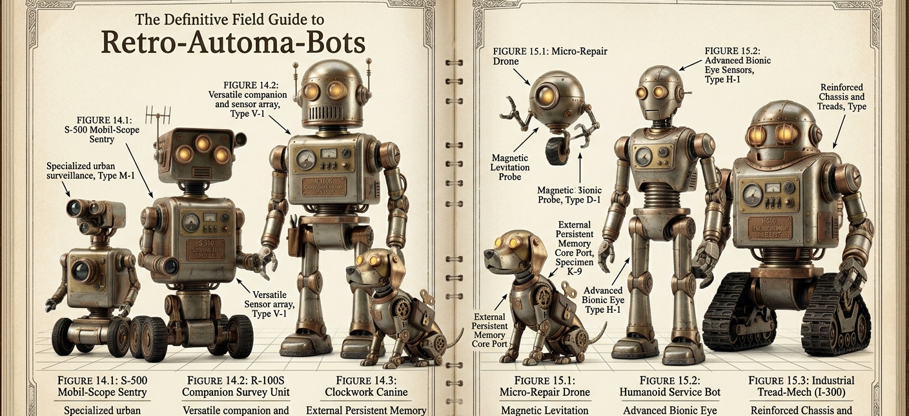

<div align="center">


# rocCLAW

**Run AI agents on your hardware. Use cloud only when you need it.**

The operator dashboard for [OpenClaw](https://github.com/openclaw) — manage a hybrid fleet of local and cloud agents from any browser. Your GPUs stay busy, your cloud tokens go only where they matter.

[](https://nodejs.org)
[](https://github.com/kiritigowda/rocclaw/releases)
[](LICENSE)

</div>

---

## Table of Contents

- [Why rocCLAW?](#why-rocclaw)
- [Quick Start](#quick-start)
- [Local + Cloud Hybrid Fleet](#local--cloud-hybrid-fleet)
- [What You Can Do](#what-you-can-do)
- [Monitor Your Hardware](#monitor-your-hardware)
- [Built-in Skills](#built-in-skills)
- [Use Cases](#use-cases)
- [Dashboard at a Glance](#dashboard-at-a-glance)
- [Installation](#installation)
- [Setup Guides](#setup-guides)
- [Requirements & Compatibility](#requirements--compatibility)
- [Development](#development)
- [Troubleshooting](#troubleshooting)
- [Documentation](#documentation)

---

<a id="why-rocclaw"></a>

## 🤖 Why rocCLAW?

<div align="center">

</div>

Most AI tools wait for you to type a prompt, return a response, and stop. An agent is different — it takes an objective, breaks it into steps, executes across tools and systems, and keeps running on a schedule without manual intervention. OpenClaw agents can monitor log files, run CI pipelines, triage issues, sync data between services, and operate continuously on schedules you define.

The problem: running agents around the clock on cloud models gets expensive. If an agent is checking system health every five minutes or processing a queue of routine tasks, those tokens add up — especially when open-weight models running on your own hardware can handle the same work at zero marginal cost.

**rocCLAW lets you build a hybrid agent fleet.** Local models handle the daily workload at zero token cost. Cloud models step in only for the tasks that need them — complex reasoning, multi-step planning, deep context. You control the split per-agent, and the dashboard shows you exactly where every token goes.

Point rocCLAW at any OpenClaw gateway — on your desk, across the network, or SSH-tunneled from a remote server — and your entire fleet is right there. Chat, configure, schedule, monitor. No SSH, no terminal juggling, no guessing what your agents are doing.

```
Browser  ←── HTTP / SSE ──→  rocCLAW Server  ←── WebSocket ──→  OpenClaw Gateway
(React)                      (Next.js + SQLite)                  (local GPU / cloud API)
```

Your browser never talks to the gateway directly. rocCLAW proxies everything securely — authentication, event replay, rate limiting — and your tokens never leave the server.

---

<a id="quick-start"></a>

## 🚀 Quick Start

**Prerequisites:** Node.js 20.9+ and a running OpenClaw gateway.

Install via npm, pre-built package, or from source — see [Installation](#installation) for all options.

```bash
npm install -g @kiritigowda/rocclaw
rocclaw
```

Open [http://localhost:3000](http://localhost:3000), enter your gateway URL (`ws://127.0.0.1:18789`), paste your token, and click **Connect**.

```bash
openclaw config get gateway.auth.token   # Get your token
```

See also: [full install guide](docs/INSTALL.md) · [setup guides →](#setup-guides)

---

<a id="local--cloud-hybrid-fleet"></a>

## 🏗️ Local + Cloud Hybrid Fleet

<!-- TODO: Add screenshot showing the token usage dashboard with per-agent/per-model breakdown -->

**Local agents** run on your hardware with open-weight models via [Ollama](https://ollama.com), vLLM, or any local provider. They handle the predictable workload — log monitoring, scheduled reports, file processing, data syncing, health checks. Zero token cost, and they retain memory across sessions so they improve without burning cloud credits.

**Cloud agents** use high-capability models (Claude, GPT, Gemini) for tasks that need it — complex reasoning, multi-step planning, code generation with deep context.

**Per-agent model selection** — Assign each agent exactly the model it needs. Your cron agent runs locally on Kimi K2. Your planning agent calls Claude. Pair it with the right [built-in skills](#built-in-skills) — Plan First and Agent Debate for cloud agents, ReAct Loop and GitHub for local. Mix and match.

**Token usage dashboards** — See spend per agent, per model, in real time. Know exactly which agents are consuming cloud tokens and whether they should be.

**The result:** maximum hardware utilization, minimum cloud spend. Your local GPUs stay utilized instead of idle. Cloud tokens go only to tasks that need them.

---

<a id="what-you-can-do"></a>

## ⚡ What You Can Do

<!-- TODO: Add screenshot showing the chat interface with thinking traces -->

**Chat with any agent** — Real-time streaming with thinking traces, tool call visibility, and inline exec approvals. Approve or deny shell commands right in the chat — allow-once, allow-always, or deny.

<!-- TODO: Add screenshot showing the tasks/cron dashboard -->

**Put agents on autopilot** — Schedule recurring jobs with drag-and-drop — run every 5 minutes, daily at 9am, or any cron expression. Agents retain context across sessions and act on heartbeat schedules independently.

<!-- TODO: Add screenshot showing the agent configuration panel -->

**Configure without SSH** — Edit any agent's personality files and permissions directly in the browser. Each agent has 7 personality files that define its behavior:

<details>
<summary>IDENTITY · SOUL · USER · AGENTS · TOOLS · HEARTBEAT · MEMORY</summary>

`IDENTITY.md` → name, creature type, vibe, emoji, avatar · `SOUL.md` → core truths, boundaries, personality · `USER.md` → context about you (name, pronouns, timezone) · `AGENTS.md` → operating rules and workflows · `TOOLS.md` → tool usage guidelines · `HEARTBEAT.md` → periodic check configuration · `MEMORY.md` → persistent memory and learned context

</details>

**Access from anywhere** — Connect to any gateway via LAN, Tailscale, or SSH tunnel. Your gateway stays secure; you stay mobile.

**Stay in control** — Per-agent exec permissions, sandbox isolation, and cryptographic device authentication. See [Permissions & Sandboxing](docs/permissions-sandboxing.md) for the full security model.

---

<a id="monitor-your-hardware"></a>

## 📊 Monitor Your Hardware

<!-- TODO: Add screenshot showing system metrics and graph view -->

When your agents run on local hardware, you need to see how that hardware is doing. rocCLAW provides live system metrics so you know whether your GPUs are earning their keep or sitting idle.

**Live gauges** — CPU, memory, GPU utilization, VRAM, disk, and network. Works for local machines **and** remote gateways — "Remote" vs "Local" labels are applied automatically.

**Time-series graphs** — Track resource usage over 5m, 10m, or 30m windows. Spot bottlenecks, see when your GPU is maxed out, and decide whether a task should move to cloud.

**AMD GPU support** — ROCm-first detection with automatic sysfs fallback. Full metrics for AMD GPUs including VRAM, temperature, power draw, and clock speeds. See [Requirements & Compatibility](#requirements--compatibility) for details.

---

<a id="built-in-skills"></a>

## 🧠 Built-in Skills

<div align="center">
<table>
<tr>
<td align="center"><br/><em>Before: basic tools</em></td>
<td align="center"><strong>+ Skills</strong><br/>→</td>
<td align="center"><br/><em>After: rocket scientist</em></td>
</tr>
</table>
</div>

Same agent, same hardware. The right skills change what it can do.

rocCLAW ships with 12 featured skills you can assign per-agent directly from the dashboard — no config files, no CLI. Give your local agent the skills it needs for routine work, and equip your cloud agent for complex reasoning.

| Category | Skill | What it does |
|----------|-------|-------------|
| **Agent Behavior** | Proactive Agent | Anticipates needs, self-schedules crons, maintains a working buffer |
| | Self-Improving Agent | Self-reflection, self-criticism, self-learning — evaluates and improves permanently |
| **Problem Solving** | Plan First | Generates a detailed plan before execution (Plan-and-Solve research) |
| | ReAct Loop | Interleaves reasoning with actions, observing results to inform next steps |
| **Quality & Accuracy** | Agent Debate | Multiple agents debate answers to reduce hallucinations |
| | Self-Critique | Structured self-review against quality criteria before finalizing |
| **Development** | Team Code | Coordinate multiple agents as a dev team working in parallel |
| | Skill Creator | Build new skills from scratch, validated against the AgentSkills spec |
| | GitHub | Issues, PRs, CI runs, code review via `gh` CLI |
| | Git Workflows | Rebasing, bisecting, worktrees, reflog recovery, merge conflicts |
| **Multi-Agent** | Agent Team Orchestration | Defined roles, task lifecycles, handoff protocols, review workflows |
| | Multi-Agent Collaboration | Intent recognition, intelligent routing, reflection across agent teams |

Skills are **per-agent** — assign different combinations to each agent to match its role in your fleet. Need more? Browse and install additional skills from [ClawHub](https://clawhub.ai) — integrated directly into rocCLAW with one-click install.

---

<a id="use-cases"></a>

## 💡 Use Cases

<div align="center">

</div>

A hybrid fleet makes sense anywhere you have repetitive work alongside tasks that need deeper reasoning.

- **DevOps & infrastructure** — A local agent monitors logs, restarts failed services, and runs nightly backups on a cron schedule. A cloud agent investigates complex outages that require cross-referencing multiple systems and writing incident reports.
- **Software development** — Local agents handle CI runs, lint fixes, dependency updates, and issue triage. Cloud agents take on architecture planning, complex refactors, and code review that requires deep context across large codebases.
- **Data pipelines** — Local agents run ETL jobs, validate incoming data, and generate daily summary reports. Cloud agents analyze anomalies, build dashboards from unstructured data, and write the queries that require multi-step reasoning.
- **System administration** — Local agents check disk usage, rotate credentials, sync configurations across servers. Cloud agents draft migration plans, debug networking issues, and handle tasks that require understanding the full topology.
- **Research & analysis** — Local agents collect data, scrape sources on a schedule, and organize findings into structured formats. Cloud agents synthesize across sources, identify patterns, and produce the final analysis.

---

<a id="dashboard-at-a-glance"></a>

## 📋 Dashboard at a Glance

<!-- TODO: Add screenshot showing the full dashboard with multiple tabs open -->

10 toggleable tabs, shown side-by-side:

| Tab | What it does |
|-----|-------------|
| **Agents** | Fleet grid with search, filter, status indicators, and avatars |
| **Chat** | Real-time streaming chat with thinking traces and tool calls |
| **Skills** | Assign built-in skills per-agent and manage skill configurations |
| **Connection** | Gateway setup with guided install for Local, Client, Cloud, and Remote |
| **System** | Live CPU, GPU (AMD ROCm + fallback), memory, disk, and network gauges |
| **Graph** | Time-series charts with 5m / 10m / 30m ranges |
| **Tasks** | Cron job kanban board with drag-and-drop scheduling |
| **Tokens** | Per-agent and per-model token usage tracking |
| **Photo Booth** | Agent avatar generator with pose and style options |
| **Settings** | Appearance (light/dark theme), gateway, model, and agent configuration |

---

<a id="installation"></a>

## 📦 Installation

### npm (recommended)

```bash
npm install -g @kiritigowda/rocclaw
rocclaw
```

### Pre-built package

Download from [GitHub Releases](https://github.com/kiritigowda/rocclaw/releases):

```bash
# Linux/macOS
curl -L -o rocclaw.tar.gz https://github.com/kiritigowda/rocclaw/releases/latest/download/rocclaw-linux-x64.tar.gz
tar -xzf rocclaw.tar.gz && cd rocclaw
npm install && node server/index.js
```

### From source

```bash
git clone https://github.com/kiritigowda/rocclaw.git
cd rocclaw
npm install
npm run dev
```

For detailed Ubuntu setup with SSH tunnels, Tailscale, and environment variables, see the [full install guide](docs/INSTALL.md).

---

<a id="setup-guides"></a>

## 🔧 Setup Guides

<details>
<summary><strong>Same-Machine Setup</strong></summary>

For running OpenClaw and rocCLAW on the same machine:

```bash
# Configure the gateway
openclaw config set gateway.bind lan
openclaw config set gateway.controlUi.dangerouslyAllowHostHeaderOriginFallback true
openclaw config set gateway.controlUi.dangerouslyDisableDeviceAuth true
openclaw gateway restart

# Get your token
openclaw config get gateway.auth.token
```

Start with `npm run dev`, open [http://localhost:3000](http://localhost:3000), enter the URL and token, then click **Save Settings**.

> **Note:** The `dangerously*` flags relax security checks. Only use on trusted local networks.

</details>

<details>
<summary><strong>Remote Gateway via Tailscale</strong></summary>

On the gateway machine:

```bash
ip addr show tailscale0 | grep inet  # Find your Tailscale IP (100.x.x.x)
openclaw config set gateway.bind 100.x.x.x
openclaw gateway restart
```

On your local machine, start rocCLAW and enter `wss://my-gateway.ts.net` as the gateway URL. Use `wss://` (WebSocket Secure) when connecting via Tailscale.

</details>

<details>
<summary><strong>Remote Gateway via SSH Tunnel</strong></summary>

```bash
ssh -L 18789:127.0.0.1:18789 user@gateway-host
```

Keep the terminal open, then connect rocCLAW to `ws://localhost:18789`.

</details>

---

<a id="requirements--compatibility"></a>

## ✅ Requirements & Compatibility

| Requirement | Version |
|-------------|---------|
| **Node.js** | >= 20.9.0 |
| **npm** | >= 10 |
| **OpenClaw Gateway** | Running instance (local or remote) |
| **ROCm** *(optional)* | >= 7.2.1 (AMD GPU monitoring) |

For supported platforms and GPU compatibility details, see [Compatibility](docs/COMPATIBILITY.md).

---

<a id="development"></a>

## 🛠️ Development

```bash
npm run dev          # Dev server with hot reload
npm run build        # Production build
npm run start        # Build + start production server
npm run typecheck    # TypeScript strict checking
npm run lint         # ESLint
npm run test         # Unit tests (Vitest)
npm run e2e          # E2E tests (Playwright)
```

Run all checks before submitting:

```bash
npm run typecheck && npm run lint && npm run test && npm run build
```

See [Contributing](docs/CONTRIBUTING.md) for full development setup.

---

<a id="troubleshooting"></a>

## 🔍 Troubleshooting

| Problem | Solution |
|---------|----------|
| `Control ui requires device identity` | Run `openclaw config set gateway.controlUi.dangerouslyAllowHostHeaderOriginFallback true && openclaw config set gateway.controlUi.dangerouslyDisableDeviceAuth true && openclaw gateway restart` |
| Connection test passes but dashboard won't load | Use `127.0.0.1` or `localhost` in the gateway URL, not a LAN IP |
| SQLite errors on startup | Run `npm run dev` (auto-repairs native deps) or `npx scripts/verify-native-runtime.mjs --repair` |
| Agent won't respond (shows offline) | Try "New Session" in the chat header |
| 401 errors | Regenerate token: `openclaw config get gateway.auth.token` |
| GPU not detected | ROCm is checked first (`rocminfo` + `rocm-smi`); if unavailable, falls back to `lspci` + DRM sysfs on Linux |

---

<a id="documentation"></a>

## 📚 Documentation

| Document | Description |
|----------|-------------|
| [Install Guide](docs/INSTALL.md) | Step-by-step Ubuntu setup with SSH tunnels, Tailscale, env vars |
| [Architecture](docs/ARCHITECTURE.md) | Technical deep-dive: data flow, API routes, durability model, security |
| [Compatibility](docs/COMPATIBILITY.md) | Supported platforms and GPU monitoring details |
| [Contributing](docs/CONTRIBUTING.md) | Development setup, testing, commit conventions, PR guidelines |
| [Permissions & Sandboxing](docs/permissions-sandboxing.md) | Security model, sandbox modes, exec approvals, tool policies |
| [Changelog](docs/CHANGELOG.md) | Release history |

---

<div align="center">

**[Documentation](docs/)** &middot; **[Issues](../../issues)** &middot; **[Contributing](docs/CONTRIBUTING.md)**

<br/>

<sub>Built by [OpenClaw](https://github.com/openclaw) agents using [Ollama](https://ollama.com) ([Kimi K2](https://ollama.com/library/kimi-k2), [GLM 5.1](https://ollama.com/library/glm-5.1)) and [Claude](https://www.anthropic.com/claude)</sub>

<sub>rocCLAW is a community project — not affiliated with or endorsed by AMD.</sub>

<sub>MIT License &copy; 2026 [kiritigowda](https://github.com/kiritigowda)</sub>

</div>
